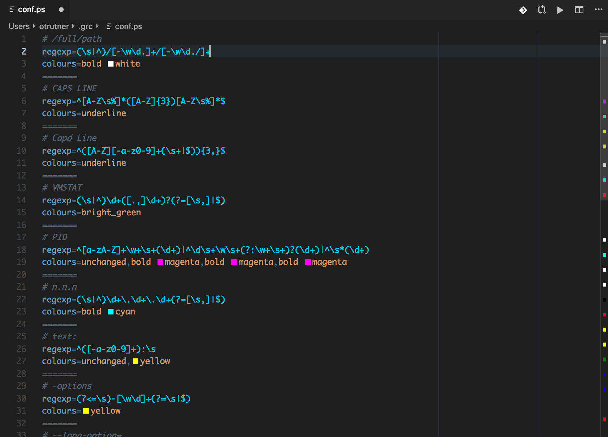

# grc-syntax-highlighting README

A syntax highlighting and completion extension for the grc 'Generic Colouriser'
configuration files.

[grc](https://github.com/garabik/grc), the 'Generic Colouriser' colorizes the
output of terminal applications.  It comes with a large set of configuration
files specifying how to colorize the output of various apps.  You can colorize
the output of apps of your choice by adding `conf.app-name` files in your
`.grc/` folder.

Use this extension to edit grc configuration files.

## Release Notes

### 0.0.2

Added color preview.

### 0.0.1

This is the initial release.  It colors keys, values, operators, seprators and
comments.  It also introduces completion to keys and values.
